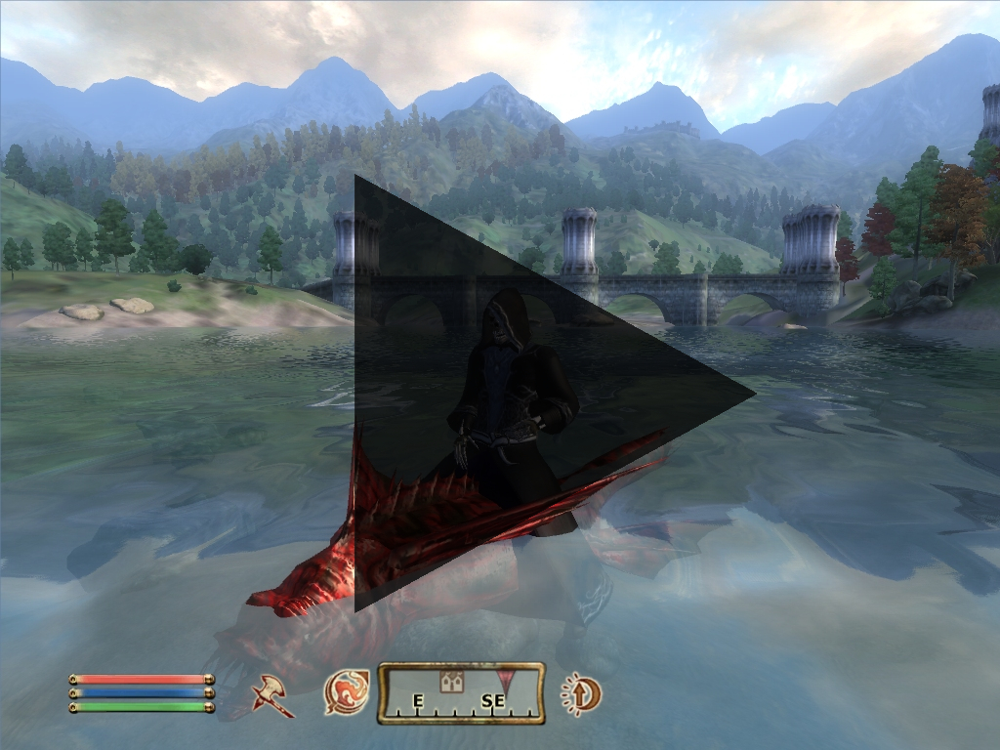

# Readme for sinHHHans Rideable Slaughterfish

## Summary

- Game: TES IV - Oblivion
- Name of Mod: sinHHHans Rideable Slaughterfish
- Version: 1.0
- Release-Date: April 2007
- Author: sinHHHans

## Description

This Mod adds a Rideable Slaughterfish Mount in the Imperial City - Waterfront. It is a mount made for water.

### Location
When you fast travel to Waterfront, walk straight along the bridge which is in front of you. 
At the end of that bridge you can see the fish on your left side.

You also get a spell for calling your fish if you need it.

## Installation

Unzipp the .esp file to `\Oblivion\Data\`

## Uninstallation
Delete "sinHHHans' RideableSlaughterFish.esp" from your `Oblivion\data` folder.

## Known Bugs
None yet.
You may wonder why the fish is also working out of water. This works as designed for a good reason. I made that because otherwise it could stop on the ground, where the water is too shallow for it to swim.

## Credits

Many thanks to yarharhar